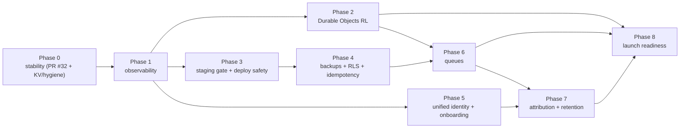

# YourRank — Full Actionable Launch Plan

> Turns [`architecture-target.md`](./architecture-target.md) into concrete, sequenced,
> reviewable work. Each item is a **PR-sized task** with scope, acceptance criteria, and
> dependencies. Phases are ordered so the platform is *stable first, valuable second*.
>
> Legend — **Effort:** S (≤1d) · M (2–3d) · L (~1wk). **Owner:** fill in.
> **Status:** ☐ todo · ◐ in progress · ☑ done.

---

## Phase 0 — Stop the bleeding (stability)  · target: week 1

### 0.1 ☑ Fail-open rate limiter + 1101 guards + bot customization — **PR #32**
- Done. Rate limiter degrades instead of denying; Worker entry points guarded; bot
  welcome-message + custom-commands UI/API shipped.
- **Acceptance:** CI green; live endpoints no longer 429 on first hit; hard-refresh no 1101.

### 0.2 ☐ Raise / de-risk the KV write quota  · Effort S · depends: none
- **Why:** even fail-open means rate limiting is *off* once the free-tier ~1k writes/day
  is spent. This is an **account action**, not code.
- **Do:** upgrade the Cloudflare account owning the `SESSIONS` namespace to Workers Paid,
  OR confirm 2.1 (Durable Objects) lands fast enough to remove the KV write dependency.
- **Acceptance:** documented KV write headroom > peak daily requests, or 2.1 merged.

### 0.3 ☐ Repo hygiene pass  · Effort S · depends: none
- **Why:** 15+ stale audit/plan `.md` files at root add noise and mislead debugging.
- **Do:** move historical audits to `docs/history/`, keep `README`, `ARCHITECTURE`,
  `DEPLOY`, `CONTRIBUTING`, `CHANGELOG` current; delete dead code paths flagged in audits.
- **Acceptance:** root has ≤6 top-level docs; `docs/` is the single source of truth.

---

## Phase 1 — See problems before users do (observability)  · week 1–2

### 1.1 ☐ Sentry on the site Worker  · Effort S · depends: none
- **Why:** the bot Worker has Toucan; the site Worker has none, so its errors are blind.
- **Do:** add Toucan/Sentry to `apps/leaderboard/src/index.js` inside the top-level
  try/catch (mirror the bot). Tag `worker=site`, release = package version.
- **Acceptance:** a forced throw shows up in Sentry with stack + request context.

### 1.2 ☐ Golden-path uptime checks  · Effort M · depends: none
- **Why:** the outage was only found via a user report.
- **Do:** synthetic checks (Cloudflare Health Checks or an external monitor) every 1–5 min
  on: `GET /health`, `POST /api/auth/login` (canary account), `GET /r/<known-slug>`,
  `POST /pb` (canary key), public board render. Alert to Slack/Discord/email on failure.
- **Acceptance:** killing a canary path pages within 5 min.

### 1.3 ☐ Structured logs + Logpush  · Effort S · depends: 1.1
- **Do:** consistent JSON log lines (`level`, `worker`, `route`, `req_id`); enable Logpush
  (or Workers Logs) to a queryable store. Add a `req_id` header echoed in responses.
- **Acceptance:** can grep a single request across both Workers by `req_id`.

### 1.4 ☐ `withWorker()` entry-point wrapper  · Effort S · depends: 1.1
- **Why:** make "every entry point returns a Response + reports to Sentry" impossible to
  forget (prevents future 1101s).
- **Do:** shared helper wrapping `fetch`/`queue`/`scheduled`; adopt in both Workers.
- **Acceptance:** all handlers routed through it; lint/PR checklist references it.

---

## Phase 2 — Remove the outage root cause (infra)  · week 2–3

### 2.1 ☐ Rate limiting → Durable Objects  · Effort L · depends: 1.x for safety
- **Why:** eliminates per-request KV writes entirely; atomic, consistent counters.
- **Do:**
  1. Add a `RateLimiter` Durable Object (fixed/sliding window) with a small RPC surface
     `check(key, limit, windowSec) -> {ok, remaining, retryAfter}`.
  2. Reimplement `shared/ratelimit.ts` to call the DO; keep the **same signature** so
     callers (`admin:`, `redirect:`, `pb:`, dashboard/auth) don't change.
  3. Keep **fail-open** if the DO is unreachable.
  4. Bind the DO in both `wrangler.toml`s (site + bot).
- **Acceptance:** load test at peak RPS shows correct limiting with **zero** KV writes for
  rate limiting; existing ratelimit tests pass against the DO-backed impl.
- **Rollback:** feature-flag `RL_BACKEND=kv|do` to flip back instantly.

### 2.2 ☐ KV usage audit  · Effort S · depends: 2.1
- **Do:** confirm KV is now sessions + cache only (write-rarely); add a metric on KV
  write rate so a regression is caught early.
- **Acceptance:** KV daily writes < 10% of quota under normal load.

---

## Phase 3 — Safe delivery (environments & CI)  · week 3

### 3.1 ☐ Staging smoke-test gate  · Effort M · depends: 1.2
- **Why:** staging Workers/KV already exist in wrangler config but aren't a gate.
- **Do:** pipeline deploys to `staging.yourrank.site`, runs the golden-path synthetic
  suite, and only then promotes to prod.
- **Acceptance:** a deliberately broken build fails at staging and never reaches prod.

### 3.2 ☐ Independent deploy jobs + post-deploy smoke + rollback  · Effort M · depends: 3.1
- **Why:** a bot typecheck failure once aborted `deploy-bot` (PR #30). Keep failures
  isolated and auto-rollback bad deploys.
- **Do:** `deploy-site` and `deploy-bot` independent; each runs a post-deploy smoke check;
  on failure, `wrangler rollback` and alert.
- **Acceptance:** injected post-deploy failure triggers automatic rollback + alert.

### 3.3 ☐ Migration dry-run in CI  · Effort S · depends: none
- **Do:** every PR runs `supabase/migrations` against an ephemeral Postgres; block merge
  on failure. No manual prod SQL.
- **Acceptance:** a bad migration fails CI, not prod.

---

## Phase 4 — Data safety  · week 3–4

### 4.1 ☐ Backups + tested restore (PITR)  · Effort S · depends: none
- **Do:** enable Supabase PITR/automated backups; perform one **restore drill** to a
  scratch project and document RTO/RPO.
- **Acceptance:** a documented, timed successful restore exists.

### 4.2 ☐ RLS cross-tenant isolation test  · Effort M · depends: 3.3
- **Do:** automated test asserting streamer A cannot read/write streamer B's boards,
  bots, offers, conversions via the anon key.
- **Acceptance:** test fails if any RLS policy is loosened.

### 4.3 ☐ Idempotency audit for money  · Effort S · depends: none
- **Do:** verify NOWPayments IPN (tx ref) and conversions dedupe under replay; add tests
  that replay the same webhook twice and assert single effect.
- **Acceptance:** duplicate webhooks never double-credit.

---

## Phase 5 — Unify identity & onboarding (activation)  · week 4–5

### 5.1 ☐ Single account with linked Telegram identity  · Effort L · depends: 1.x
- **Why:** two logins (email/password on site, Telegram on bot dash) confuse users and
  double the auth surface.
- **Do:** one account; link a Telegram identity to it; bot connect/customize move into the
  main dashboard. `/bot/dashboard` becomes a section, not a separate app.
- **Acceptance:** a user logs in once and can connect + customize a bot without a second login.
- **Migration:** map existing Telegram-only bot-dash users to accounts by Telegram id/email.

### 5.2 ☐ One-paste bot onboarding  · Effort M · depends: 5.1
- **Do:** paste BotFather token → validate → create row → set webhook → auto-generate a
  tracked link for the first offer, all in one flow with clear errors.
- **Acceptance:** median time from "paste token" to "bot live" < 60s in staging test.

### 5.3 ☐ Activation funnel metric  · Effort S · depends: 1.3, 5.2
- **Do:** instrument signup → bot connected → first tracked click; surface drop-off.
- **Acceptance:** funnel visible in the analytics/observability store.

---

## Phase 6 — Scale the hot path (Queues)  · week 5–6

### 6.1 ☐ Clicks/conversions → Cloudflare Queues  · Effort L · depends: 1.x, 4.x
- **Why:** `/r/:slug` and `/pb` write to Postgres inline; decouple to absorb stream spikes.
- **Do:** edge Worker validates + enqueues an event and returns immediately; a consumer
  Worker batches inserts + updates rollups; retries on failure.
- **Acceptance:** load test shows redirect p99 < 15ms and no lost events under spike +
  transient DB errors.

### 6.2 ☐ Cache invalidation on score update  · Effort S · depends: 6.1
- **Do:** explicit L1/L2 invalidation when standings change so boards aren't stale.
- **Acceptance:** score update reflects on public board within the defined TTL bound.

---

## Phase 7 — The buying reason (attribution) & retention  · week 6–8

### 7.1 ☐ Attribution dashboard  · Effort L · depends: 6.x
- **Do:** "you drove $X in deposits / N depositors" with per-offer/campaign/link
  breakdowns and CSV export. This is the artifact streamers show affiliate managers.
- **Acceptance:** numbers reconcile against `clicks`/`conversions`; export matches UI.

### 7.2 ☐ Bot retention toolkit  · Effort M · depends: 5.1
- **Do:** scheduled broadcasts, "code of the day" auto-post, welcome DM, subscriber
  segmentation (clicked vs deposited) — on top of the custom commands from PR #32.
  Enforce per-bot send limits + unsubscribe compliance.
- **Acceptance:** a scheduled broadcast sends to a segment with rate limiting + opt-out.

### 7.3 ☐ Premium overlay polish  · Effort M · depends: none
- **Do:** themes, sponsor slots, smoother FLIP; keep it a paid unlock (free = upsell).
- **Acceptance:** overlay stable at 60fps with 50+ players; theming works.

### 7.4 ☐ Plans tied to value  · Effort S · depends: 7.1
- **Do:** free = leaderboard; paid = overlay + broadcasts + postbacks + multi-board +
  custom domain. Price against affiliate revenue unlocked.
- **Acceptance:** plan gates enforced server-side; upgrade flow works (crypto + Stars).

---

## Phase 8 — Launch readiness  · week 8

### 8.1 ☐ Security review + pen-test pass  · Effort M
- Secrets audit, CSP `report-uri`, Turnstile on signup/login, admin audit-log coverage,
  postback legacy-path sunset enforced.
### 8.2 ☐ Load test to target concurrency  · Effort M · depends: 2.1, 6.1
- k6 on `/r`, `/pb`, board render at projected launch RPS; fix the first bottleneck found.
### 8.3 ☐ Runbooks + status page  · Effort S · depends: 1.x
- On-call runbook per golden path (symptom → check → fix, using the `docs/*architecture*`
  "where do I look" indexes); public status page.
### 8.4 ☐ Launch checklist sign-off  · Effort S
- All Phase 0–4 items ☑; monitoring live; backups tested; rollback proven.

---

## Dependency map (critical path)



**Do-first (removes debugging traps):** Phases 0 → 1 → 2 → 3 → 4.
**Then (makes it worth paying for):** Phases 5 → 6 → 7, converging on Phase 8.

---

## Suggested PR sequence (each independently shippable)

1. ~~fail-open + 1101 + bot customization~~ **(PR #32 — open)**
2. Sentry on site Worker + `withWorker()` wrapper *(1.1, 1.4)*
3. Golden-path uptime checks + structured logs/Logpush *(1.2, 1.3)*
4. Durable Objects rate limiter behind `RL_BACKEND` flag *(2.1, 2.2)*
5. Staging smoke gate + independent deploys + rollback + migration dry-run *(3.x)*
6. Backups/PITR drill doc + RLS isolation test + money idempotency tests *(4.x)*
7. Unified account/identity + bot dashboard merge *(5.1)*
8. One-paste onboarding + activation funnel *(5.2, 5.3)*
9. Queues for clicks/conversions + cache invalidation *(6.x)*
10. Attribution dashboard *(7.1)*
11. Bot retention toolkit *(7.2)*
12. Overlay polish + plan gating *(7.3, 7.4)*
13. Security review, load test, runbooks/status, launch sign-off *(8.x)*
```
